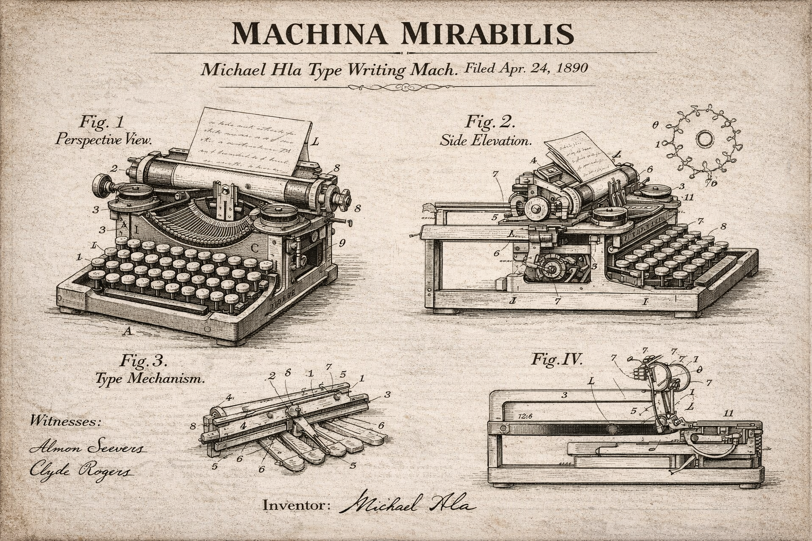

# GPT-1900

<p align="center">
  
</p>

<p align="center">
  <em>An experiment to see if an LLM trained from scratch on text prior to 1900 can come up with quantum mechanics and relativity.</em>
</p>

<p align="center">
  <a href="https://huggingface.co/collections/mhla/gpt-1900"></a>
  <a href="https://michaelhla.com/blog/machina-mirabilis.html"></a>
  <a href="https://x.com/hla_michael"></a>
</p>

## Chat with GPT-1900

Requires Python 3.10+ and [uv](https://docs.astral.sh/uv/):

```bash
git clone https://github.com/mhla/gpt1900.git
cd gpt1900
uv sync --extra gpu    # or --extra cpu for CPU / Apple Silicon
source .venv/bin/activate

# Download and chat (instruction-tuned model)
bash runs/chat.sh

# Chat with the RL model
bash runs/chat.sh -r mhla/gpt1900-d34-contradiction-rl-v11
```

## License

MIT
