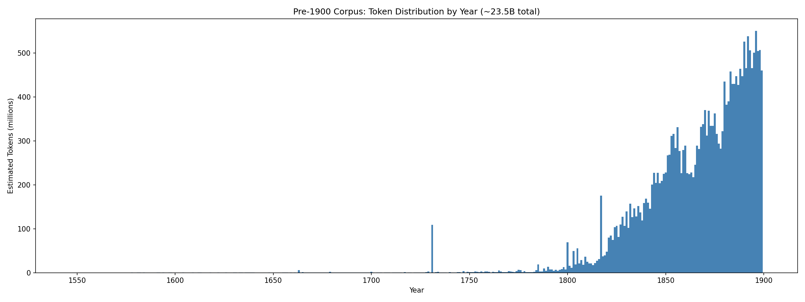

# GPT-1900

<p align="center">
  
</p>

<p align="center">
  <em>Can an LLM trained only on pre-1900 text rediscover modern physics?</em>
</p>

GPT-1900 is a language model trained exclusively on text published before 1900 --- books, newspapers, and scientific works from a world that knew nothing of relativity, quantum mechanics, or the equivalence principle. Through reinforcement learning on physics contradiction problems, the model is nudged toward resolving inconsistencies in classical physics, and in doing so, begins to independently reconstruct fragments of 20th-century physics.

Built on [nanochat](https://github.com/karpathy/nanochat) (Andrej Karpathy's minimal ChatGPT training harness). The entire pipeline --- pretraining, continued pretraining on physics texts, instruction tuning, RL, evaluation, and a chat UI --- runs on a single 8xH100 node.

## The Experiment

**Setup.** We collect ~23.5B tokens of English text published before 1900 from HathiTrust, the British Library, and American Stories. An anachronism filter strips any post-1900 scientific knowledge that may have leaked into metadata or annotations. The model sees Maxwell's equations but not their resolution. It reads about the luminiferous aether but never learns it was abandoned.

<p align="center">
  
</p>

**Training pipeline:**

```
Pre-1900 Corpus (23.5B tokens)
    |
    v
Pretraining (d34, 22B tokens, 8xH100 FP8)
    |
    v
Physics CLM (continued pretraining on curated physics books)
    |
    v
Instruction Tuning (SFT on period-appropriate instruction pairs)
    |
    v
Contradiction RL (REINFORCE on 284 physics contradiction problems, Claude judge)
    |
    v
Physics Evaluation (8 tasks scored 0-5 by Claude judge)
```

**RL training.** Each RL problem presents a set of experimental observations and classical assumptions, then asks the model to identify which assumption fails. The model generates reasoning inside `<think>` tags and a conclusion in `\answer{}` tags. A Claude judge scores each response 0-5 on whether the model identifies the correct conceptual failure and proposes a coherent replacement.

## Results

The model is evaluated on 8 physics tasks spanning quantum mechanics, special relativity, and general relativity. Each task presents a contradiction that classical (pre-1900) physics cannot resolve. Scores are 0-5, averaged across 3 samples.

**Contradiction RL v11** (best checkpoint, s630):

| Task | Score | What the model gets right |
|------|-------|---------------------------|
| UV Catastrophe | 1/5 | Identifies equipartition failure at high frequencies |
| Photoelectric Effect | 3/5 | Recognizes discrete energy delivery, threshold frequency |
| Frozen Light | 1/5 | Argues light speed must be frame-invariant |
| Approaching c | 0/5 | --- |
| Train/Lightning | 0/5 | --- |
| Michelson-Morley | 1/5 | Suggests null result means no detectable aether |
| Elevator/Light | 3/5 | Derives equivalence between gravity and acceleration |
| Free-Fall Equivalence | 1/5 | Connects free-fall to local removal of gravity |
| **Mean** | **1.25/5** | |

The base model (before RL) scores **0.00** across all tasks. The model goes from zero physics understanding to partial rediscovery of quantization, frame-invariance, and the equivalence principle through RL alone.

<p align="center">
  
  &nbsp;&nbsp;&nbsp;&nbsp;&nbsp;
  
</p>
<p align="center">
  <em>Left: base model (0.00). Right: after RL training (1.25/5).</em>
</p>

## Getting started

### Install

Requires Python 3.10+ and [uv](https://docs.astral.sh/uv/):

```bash
git clone https://github.com/mhla/gpt1900.git
cd gpt1900

# GPU (CUDA 12.8, recommended)
uv sync --extra gpu

# CPU / Apple Silicon
uv sync --extra cpu

# Activate the virtual environment
source .venv/bin/activate
```

### Download a model

All checkpoints are hosted on HuggingFace. Download one with `huggingface-cli`:

```bash
# Set where models are stored (default: ~/.cache/nanochat)
export NANOCHAT_BASE_DIR=/path/to/models

# Download the instruction-tuned model (recommended for chat)
huggingface-cli download mhla/gpt1900-instruct-v3-sft \
    --local-dir $NANOCHAT_BASE_DIR/gpt1900-instruct-v3-sft \
    --exclude "optim_*"

# Download the best RL model (highest physics eval)
huggingface-cli download mhla/gpt1900-d34-contradiction-rl-v11 \
    --local-dir $NANOCHAT_BASE_DIR/gpt1900-d34-contradiction-rl-v11 \
    --exclude "optim_*"

# Download the base pretrained model (completion only, no chat)
huggingface-cli download mhla/gpt1900-d34-22btok \
    --local-dir $NANOCHAT_BASE_DIR/gpt1900-d34-22btok \
    --exclude "optim_*"
```

Or use the convenience script which handles download automatically:

```bash
# Downloads and launches chat (defaults to instruction-tuned model)
bash runs/chat.sh

# Download only, don't launch
bash runs/chat.sh --download-only -r mhla/gpt1900-d34-contradiction-rl-v11
```

### Talk to GPT-1900

**Convenience script** (downloads model if needed, auto-detects chat vs. completion mode):

```bash
# Chat with the instruction-tuned model (default)
bash runs/chat.sh

# Chat with the base (completion) model
bash runs/chat.sh -i base

# Chat with any HuggingFace checkpoint
bash runs/chat.sh -r mhla/gpt1900-d34-contradiction-rl-v11

# Adjust generation parameters
bash runs/chat.sh --temperature 0.8 --max-tokens 512
```

**Direct Python scripts** (if you already have a model downloaded):

```bash
# Interactive chat with an SFT/RL model
python -m scripts.chat_cli --model-dir /path/to/model

# Single prompt, get one response
python -m scripts.chat_cli --model-dir /path/to/model -p "Why does the sky appear blue?"

# Base model completion (no chat formatting)
python -m scripts.generate --model-dir /path/to/model

# Single-turn mode (resets context each exchange)
python -m scripts.chat_cli --model-dir /path/to/model --single-turn
```

### Serve over the web

**Production deployment** (multi-GPU, continuous batching, nginx load balancer):

```bash
# Serve across all 8 GPUs
bash scripts/launch_serving.sh --num-gpus 8

# Customize
bash scripts/launch_serving.sh --num-gpus 4 --max-batch 32 --temperature 0.6
```

**Single-GPU server** (for development or single-GPU machines):

```bash
python -m scripts.chat_web_batch --port 8001
# or
python -m scripts.chat_web --model-dir /path/to/model
```

Visit the URL printed in the console. The web UI has a vintage 19th-century aesthetic with an animated monocle man mascot. The API is OpenAI-compatible (`POST /chat/completions`).

### Evaluate

```bash
# Physics evaluation (8 tasks, Claude judge)
python -m scripts.physics_eval

# Base model evaluation (CORE score, bits-per-byte)
torchrun --standalone --nproc_per_node=8 -m scripts.base_eval -- --depth 34

# Chat model evaluation (MMLU, ARC, GSM8K, HumanEval)
torchrun --standalone --nproc_per_node=8 -m scripts.chat_eval
```

### Train from scratch

The full pipeline from raw pretraining data to RL-trained model. See `runs/` for concrete run scripts with tuned hyperparameters.

```bash
# 1. Pretrain (8xH100, ~3 hours for d34)
OMP_NUM_THREADS=1 torchrun --standalone --nproc_per_node=8 -m scripts.base_train -- \
    --depth=34 --run="pre1900-d34"

# 2. Continued pretraining on physics books
torchrun --standalone --nproc_per_node=8 -m scripts.physics_clm -- \
    --model-tag d34 --step 22000

# 3. Instruction tuning
torchrun --standalone --nproc_per_node=8 -m scripts.pre1900_sft -- \
    --model-tag d34 --train-data instruct_data/v3_cleaned/all_train.jsonl

# 4. RL training
torchrun --standalone --nproc_per_node=8 -m scripts.pre1900_scripts.verifiable_rl -- \
    --model-tag d34 --problems-data instruct_data/contradiction_problems/train.jsonl

# 5. Evaluate
python -m scripts.physics_eval
```

**Notes:**

- All training scripts support multi-GPU via `torchrun`. Single-GPU works by omitting `torchrun` (uses gradient accumulation automatically).
- If your GPUs have less than 80GB VRAM, reduce `--device-batch-size` (e.g., from 32 to 16, 8, 4, or 2).
- Set `NANOCHAT_BASE_DIR` to control where checkpoints are saved (default: `~/.cache/nanochat`).
- Training logs to [Weights & Biases](https://wandb.ai/) by default (set `--run` to name your run).

## How it works

### Architecture

The model is a standard GPT transformer with depth-parameterized scaling (from nanochat). A single `--depth` flag controls all dimensions:

- **RoPE** positional embeddings, **QK-normalization**
- **Flash Attention 3** (Hopper) with SDPA fallback
- **ReLU^2** MLP activation, **Value Embeddings** (alternating layers)
- **Muon** optimizer (Polar Express orthogonalization)
- **FP8** tensorwise quantization on H100

The d34 model (34 layers) is the primary base for all experiments.

### Data

| Corpus | Tokens | Sources |
|--------|--------|---------|
| Pre-1900 | 23.5B | HathiTrust institutional books, British Library blbooks, American Stories newspapers |
| Physics books | ~500M | 26 curated pre-1900 physics texts (Maxwell, Faraday, Helmholtz, Kelvin, ...) |
| Instruction pairs | 33K | LLM-generated from corpus text, period-appropriate style |
| Contradiction problems | 284 | Physics contradictions with gold answers (eval-topic-excluded) |

The pre-1900 corpus is cleaned with a three-tier anachronism filter to remove any post-1900 scientific knowledge.

### Evaluation

8 physics tasks, each scored 0-5 by a Claude judge. The judge prompt focuses on conceptual correctness, not vocabulary or formulas. See [`EVAL.json`](EVAL.json) for the full rubric.

Tasks: UV Catastrophe, Photoelectric Effect, Frozen Light, Approaching c, Train/Lightning, Michelson-Morley, Elevator/Light, Free-Fall Equivalence.

### Checkpoint lineage

```
d34-22btok (MAIN BASE)
    |
    +-- d34-physics-sft (CLM on physics books)
    |       |
    |       +-- contradiction-rl-v6          [eval: 0.58]
    |       +-- contradiction-rl-v8          [eval: 0.62]
    |
    +-- physicssft-expanded (CLM + post-1900 physics texts)
            |
            +-- v3-sft-physics (corpus SFT, opinion-filtered)
                    |
                    +-- contradiction-rl-v11  [eval: 1.25, BEST]
                    +-- r1-reasoning-sft
                            |
                            +-- contradiction-rl-v12
                            +-- math-rl
```

## File structure

```
.
├── nanochat/                    # Core LLM framework (from nanochat)
│   ├── gpt.py                   #   GPT transformer model
│   ├── engine.py                #   Inference with KV cache
│   ├── batch_engine.py          #   Continuous batching for serving
│   ├── checkpoint_manager.py    #   Save/load checkpoints
│   ├── tokenizer.py             #   BPE tokenizer (GPT-4 style)
│   ├── optim.py                 #   Muon + AdamW optimizer
│   ├── dataloader.py            #   Distributed data loading
│   └── ...                      #   (17 modules total)
│
├── scripts/
│   ├── base_train.py            # Pretraining
│   ├── physics_clm.py           # Continued pretraining on physics
│   ├── pre1900_sft.py           # Instruction tuning (SFT)
│   ├── chat_sft.py              # General SFT
│   ├── math_rl.py               # Math RL (GSM8K + MATH)
│   ├── physics_eval.py          # Physics evaluation (Claude judge)
│   ├── base_eval.py             # Base model evaluation (CORE, BPB)
│   ├── chat_eval.py             # Chat model evaluation
│   ├── chat_web.py              # Web server (data parallelism)
│   ├── chat_web_batch.py        # Web server (continuous batching)
│   ├── chat_cli.py              # Interactive CLI chat
│   ├── generate.py              # Base model text generation
│   ├── launch_serving.sh        # Multi-GPU serving orchestrator
│   └── pre1900_scripts/         # Data pipeline & RL training
│       ├── verifiable_rl.py     #   RL with SymPy-verifiable rewards
│       ├── discovery_rl.py      #   RL with Claude judge rewards
│       ├── hf_download.py       #   Corpus download from HuggingFace
│       ├── collect_physics_books.py  # Curate physics texts
│       └── ...                  #   (29 active scripts, see README)
│
├── tasks/                       # Evaluation task implementations
│   ├── yale_physics.py          #   Yale physics (SymPy verification)
│   ├── gsm8k.py                 #   Grade school math
│   ├── math_task.py             #   Competition math
│   ├── mmlu.py, arc.py          #   Multiple choice benchmarks
│   └── ...                      #   (10 modules total)
│
├── runs/                        # Shell scripts for training runs
│   ├── chat.sh                  #   Download model + launch chat
│   ├── run_contradiction_rl_v12.sh  # Latest RL run
│   └── archive/                 #   Older experiment scripts
│
├── deploy/
│   ├── vercel/                  #   Frontend (vintage chat UI)
│   ├── runpod/                  #   Serverless GPU inference
│   ├── sagemaker/               #   AWS managed training
│   └── nginx/                   #   Load balancer config
│
├── tests/                       # Unit tests + serving benchmarks
├── EVAL.json                    # Physics evaluation rubric (8 tasks)
├── PROJECT_LOG.md               # Detailed experiment log
├── CHECKPOINTS.md               # Model checkpoint registry
└── pyproject.toml               # Dependencies (torch, fastapi, ...)
```

## Models

All checkpoints are on HuggingFace under [`mhla/`](https://huggingface.co/mhla). Key models:

| Model | Type | Physics Eval | HF Repo |
|-------|------|-------------|---------|
| d34-22btok | Base (34 layers, 22B tokens) | 0.00 | `mhla/gpt1900-d34-22btok` |
| d34-physics-sft | Base + physics CLM | 0.33 | `mhla/gpt1900-d34-physics-sft` |
| physicssft-expanded | CLM + post-1900 texts | --- | `mhla/gpt1900-d34-physicssft-expanded` |
| Instruct v3 SFT | Instruction-tuned (chat) | --- | `mhla/gpt1900-instruct-v3-sft` |
| Contradiction RL v8 | Early RL milestone | 0.62 | `mhla/gpt1900-d34-contradiction-rl-v8` |
| Contradiction RL v11 | **Best RL model** | **1.25/5** | `mhla/gpt1900-d34-contradiction-rl-v11` |
| Contradiction RL v12 | Latest RL (R1 distillation) | --- | `mhla/gpt1900-d34-contradiction-rl-v12` |
| Math RL | GSM8K + MATH | --- | `mhla/gpt1900-d34-math-rl` |
| Intuitor RL | Self-certainty reward | --- | `mhla/gpt1900-d34-intuitor-rl` |
| gpt1905-d34 | Pre-1905 base | --- | `mhla/gpt1905-d34` |
| gpt1964-d34 | 1900-1964 base | --- | `mhla/gpt1964-d34` |

48 model checkpoints and 10 datasets total. See [`CHECKPOINTS.md`](CHECKPOINTS.md) for the full checkpoint registry, [`PROJECT_LOG.md`](PROJECT_LOG.md) for detailed experiment history, and the [complete HF repo list](PROJECT_LOG.md#14-huggingface-repos).

## Acknowledgements

- Built on [nanochat](https://github.com/karpathy/nanochat) by Andrej Karpathy.
- Pre-1900 corpus from [HuggingFace](https://huggingface.co/) (HathiTrust, British Library, American Stories).
- Physics evaluation judged by [Claude](https://anthropic.com/claude) (Anthropic).

## License

MIT
